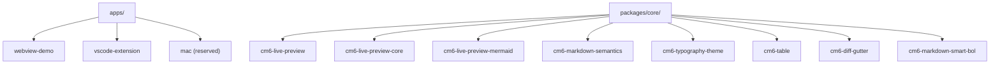
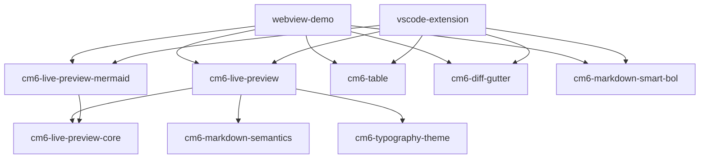
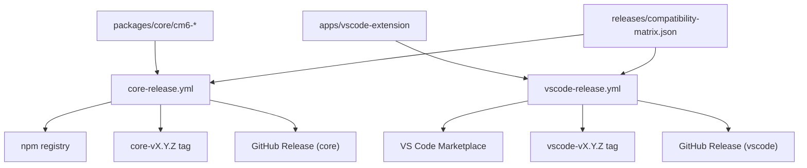

# Architecture Overview

## Package map

| package | 役割 |
| --- | --- |
| `webview-demo` | CodeMirror6 のデモ（EditorState/EditorView/共通設定） |
| `vscode-extension` | VS Code 拡張。Webview で CM6 + MarkBloom 拡張を組み合わせる |
| `cm6-live-preview-core` | Markdown記号の表示状態を動的に切り替える（syntax hide / secondary / raw） |
| `cm6-live-preview-mermaid` | Live Preview pluginとして mermaid fenced code を図widget表示する |
| `cm6-markdown-semantics` | Markdown要素を検出して範囲に semantic class を付与する |
| `cm6-typography-theme` | semantic class に対する見た目（CSSテーマ）を提供する |
| `cm6-live-preview` | 上記3つを束ね、プリセットとして配布する |
| `cm6-table` | table editor UI（2モード編集 + 行列ハンドル） |
| `cm6-diff-gutter` | baseline との差分を行頭ガターで可視化する |
| `cm6-markdown-smart-bol` | Markdown行の`Ctrl+A`をSmart BOL（見出し考慮の行頭移動）に拡張する |

## Repository Layout

## Dependency DAG

## Release Topology

## Naming contract

- semantic class prefix は `mb-` に統一する
- `cm6-markdown-semantics` が class を付与し、`cm6-typography-theme` が見た目を定義する
- release tag は配布チャネルごとに分離する（`core-v*`, `vscode-v*`）
